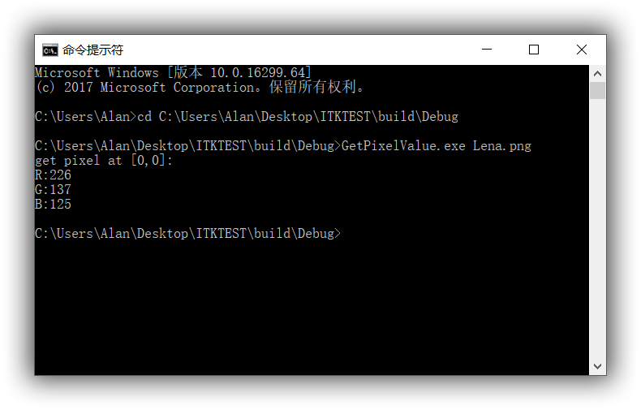

入了医学图像处理的大坑。之前用 OpenCV 比较多，但 ITK 处理医学图像(CT、MRI 等等)比较常用，因此开始自学。但发现这个库和 OpenCV 的组织方式很不一样，数据结构也差异很大，所以还挺头疼的……受学习 OpenCV 的影响，第一个程序就来读取一张 RGB 图像，并输出指定位置的像素值（总觉得得到像素值才算是图像处理的 Hello World）。

## 实现

本文环境为 VS 2015，首先编写源代码 `main.cxx`:

```cpp
/*这个程序接收输入参数作为文件路径，
读取指定的图片数据（RGB）， 
并显示指定位置的像素值。（这里是[0,0]位置）
*/

#include "itkImage.h"
#include "itkRGBPixel.h"
#include "itkImageFileReader.h"

#include <iostream>
using namespace std;

int main(int, char * argv[]) {

	//声明一些参量类型
	//指定图片像素类型为RGB,unsigned char,2维平面图
	//通过指定的图像类型声明图像读取器
	typedef itk::RGBPixel<unsigned char>PixelType;
	typedef itk::Image<PixelType, 2>ImageType;
	typedef itk::ImageFileReader<ImageType> ReaderType;
	
	//创建图像读取器
	ReaderType::Pointer reader = ReaderType::New();

	//从命令行参数获取文件路径，并设置给reader
	const char* filename = argv[1];
	reader->SetFileName(filename);
	reader->Update();

	//声明图像object，并与读取器输出绑定
	ImageType::Pointer image = ImageType::New();
	image = reader->GetOutput();

	//itk中访问图像数据需要通过Index，Index在这里理解成一个数组
	//维数与图像维数对应
	//并设置要访问的位置[0,0]
	ImageType::IndexType pixcelIndex;
	pixcelIndex[0] = 0;//列数
	pixcelIndex[1] = 0;//行数

	//获取图像的像素数据
	PixelType pixel1 = image->GetPixel(pixcelIndex);
	PixelType::ValueType red = pixel1.GetRed();
	PixelType::ValueType green = pixel1.GetGreen();
	PixelType::ValueType blue = pixel1.GetBlue();

	//输出数据，注意，itk中的像素数据需要由专门的模块来处理
	cout << "get pixel at [0,0]:" << endl;
	cout << "R:" << itk::NumericTraits<PixelType::ValueType>::PrintType(red) << endl;
	cout << "G:" << itk::NumericTraits<PixelType::ValueType>::PrintType(green) << endl;
	cout << "B:" << itk::NumericTraits<PixelType::ValueType>::PrintType(blue) << endl;

	return 0;
}
```

并编写 `CMakeLists.txt`:

```
# This is the root ITK CMakeLists file.
cmake_minimum_required(VERSION 2.8.9)
if(COMMAND CMAKE_POLICY)
  cmake_policy(SET CMP0003 NEW)
endif()


# This project is designed to be built outside the Insight source tree.
project(GetPixelValue)

# Find ITK.
find_package(ITK REQUIRED)
include(${ITK_USE_FILE})

add_executable(GetPixelValue main.cxx )

target_link_libraries(GetPixelValue ${ITK_LIBRARIES})
```

将以上两个文件保存到某个目录下，比如`C:/Users/Alan/Desktop/ITKTEST/src`下，并创建一个新目录，比如`C:/Users/Alan/Desktop/ITKTEST/build`。

打开 CMake，分别填入以上两个路径，点击`Configure`，在出现的选项列表中指定`ITK_DIR`，再次点击`Configure`，显示 `Configuring Done`，再点击 `Generate`，即可在上面的`build`目录中生成工程文件。


打开工程，将 `GetPixelValue`设为启动项目，设置模式为 `Debug x64`，然后右击生成。成功后可执行文件将在`build`目录中`Debug`文件夹下。放置一张图片到这个文件夹里，比如`Lena.png`，打开命令提示符，并执行以下命令：

```
cd 你的 GetPixelValue.exe 对应路径
GetPixelValue.exe Lena.png
```

命令行窗口就会输出指定的像素值：



## 一些结论

学习 ITK 的过程中使用 CMake 很频繁，还是要掌握的。

另外，可见 ITK 中的图像读取、存储都很依赖预先声明的像素类型：`typedef itk::RGBPixel<unsigned char>PixelType;`，这样的设计为处理多种类型的图像数据很有帮助，因为根据成像设备的不同，医学图像多有比较特殊的位深和纬度。

另外可以改变不同的 `index`，可以看出，对二维图像，ITK 存储的图像原点是左上角，`pixcelIndex[0]` 设定像素所在列数，`pixcelIndex[1]` 设定像素所在行数。