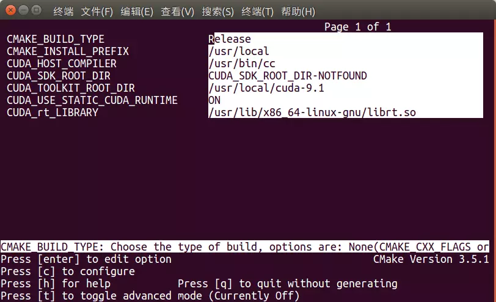
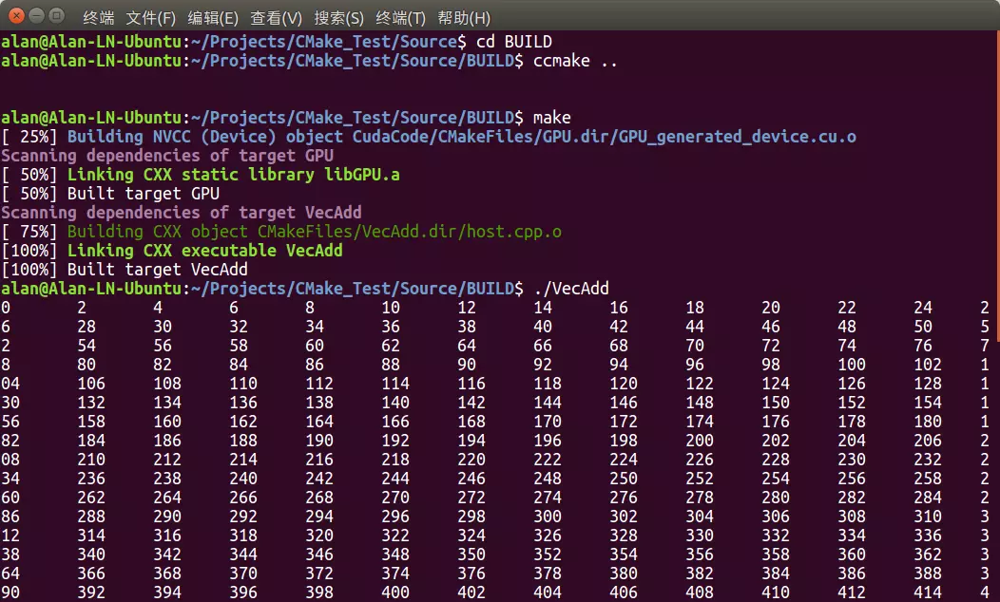

学习 CUDA 的过程中，不免会需要将一部分 Host 代码和 CUDA 代码混合编译。比如在别的文件里面写好了要在 Device 上运行的 Kernel Code，需要在不同的 Host 代码里调用，同时给 Host 代码链接不同的库。在 Windows 上使用 Visual Studio 通过包含目录、设置链接器依赖项、为每个文件指定生成方式解决，这里介绍在 Ubuntu 上使用 CMake 生成 Makefile 的方法（我觉得在 Ubuntu 上开发效率会高一点，编译什么的都很快，而且不用跟复杂的 IDE 打交道）。 

这个方法的原理是把 CUDA 代码编译为静态库，然后链接到 Host 代码上。以一个向量加法为例。

目录树如下：

```
-- Source
	|--CMakeLists.txt
	|--host.cpp
	|--CudaCode
		|--CMakeLists.txt
		|--device.cuh
		|--device.cu
```

host.cpp

```
#include <iostream>
#include "CudaCode/device.cuh"

#define N 512

int main()
{
    int h_a[N];
    int h_b[N];
    int h_c[N];

    for (int i = 0; i < N; ++i)
        h_a[i] = h_b[i] = i;

    h_vec_add(h_a, h_b, h_c, N);

    for (int i = 0; i < N; ++i)
        std::cout << h_c[i] << '\t';
    std::cout << '\n';
}
```

CMakeLists.txt

```
# required cmake version
cmake_minimum_required(VERSION 2.8)

project(VecAdd)

add_executable(VecAdd host.cpp)

add_subdirectory(CudaCode)
target_link_libraries (VecAdd GPU)
```

CudaCode/device.cuh

```
#define BX 256

extern "C"
void h_vec_add(int *a,int *b,int *c,int n);
```

CudaCode/device.cu

```
#include <device_launch_parameters.h>
#include <cuda_runtime.h>
#include "device.cuh"

//Kernel
__global__ void d_vec_add(int *d_a, int *d_b, int *d_c,int n)
{
    int i = blockIdx.x * blockDim.x + threadIdx.x;
    if (i < n)
        d_c[i] = d_a[i] + d_b[i];
}

extern "C" void h_vec_add(int *a, int *b, int *c, int n)
{
    int *d_a, *d_b, *d_c;
    cudaMalloc((void **)&d_a, sizeof(int) * n);
    cudaMalloc((void **)&d_b, sizeof(int) * n);
    cudaMalloc((void **)&d_c, sizeof(int) * n);

    cudaMemcpy(d_a, a, sizeof(int) * n, cudaMemcpyHostToDevice);
    cudaMemcpy(d_b, b, sizeof(int) * n, cudaMemcpyHostToDevice);

    dim3 DimGrid(n / BX + 1, 1, 1);
    dim3 DimBlock(BX, 1, 1);

    d_vec_add<<<DimGrid, DimBlock>>>(d_a, d_b, d_c, n);

    cudaMemcpy(c, d_c, sizeof(int) * n, cudaMemcpyDeviceToHost);

    cudaFree(d_a);
    cudaFree(d_b);
    cudaFree(d_c);
}
```

CudaCode/CMakeLists.txt

```
# required cmake version
cmake_minimum_required(VERSION 2.8)

project(GPU)

# packages
find_package(CUDA)

# nvcc flags
#set(CUDA_NVCC_FLAGS -O3;-G;-g)

file(GLOB_RECURSE CURRENT_HEADERS  *.h *.hpp *.cuh)
file(GLOB CURRENT_SOURCES  *.cpp *.cu)

source_group("Include" FILES ${CURRENT_HEADERS}) 
source_group("Source" FILES ${CURRENT_SOURCES}) 

cuda_add_library(GPU STATIC ${CURRENT_HEADERS} ${CURRENT_SOURCES})
```

然后在顶层目录执行：

```
mkdir BUILD
cd BUILD
ccmake ..
```

按 `c`，出现 CMake 的配置界面，确定其中各项对应自己机器上的路径，不对的更改就好，然后按 `c` ，再按 `g` ，可见 BUILD 目录下已经生成了 Makefile，然后：输入 `make` ，显示编译完成。



最后执行 `./VecAdd` 就能看到输出了。



如果 host.cpp 还要链接别的什么库，在顶层的 CMakeLists.txt 中指定就好。

关于 CMake 的用法，参见 CMake 官方的一个例子，从头开始讲了 CMake 的一些基础用法，用来入门蛮好：[CMake Tutorial | CMake](https://cmake.org/cmake-tutorial/) 。

