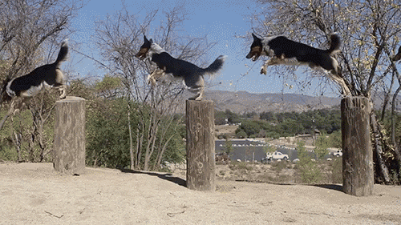
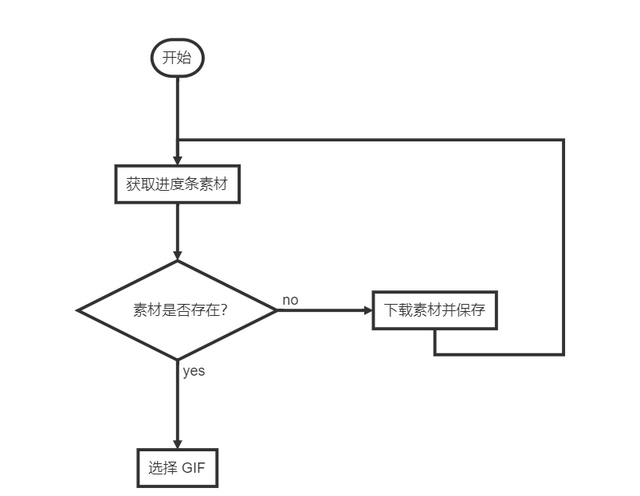
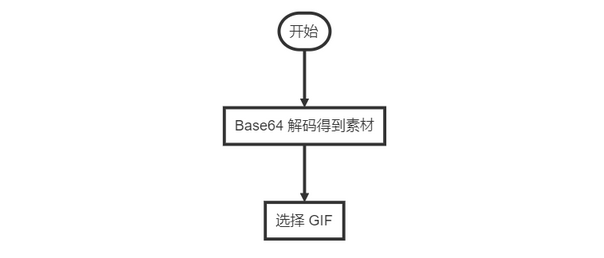
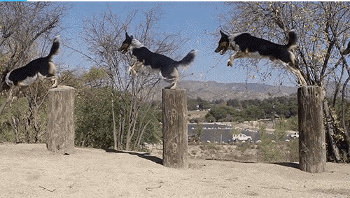
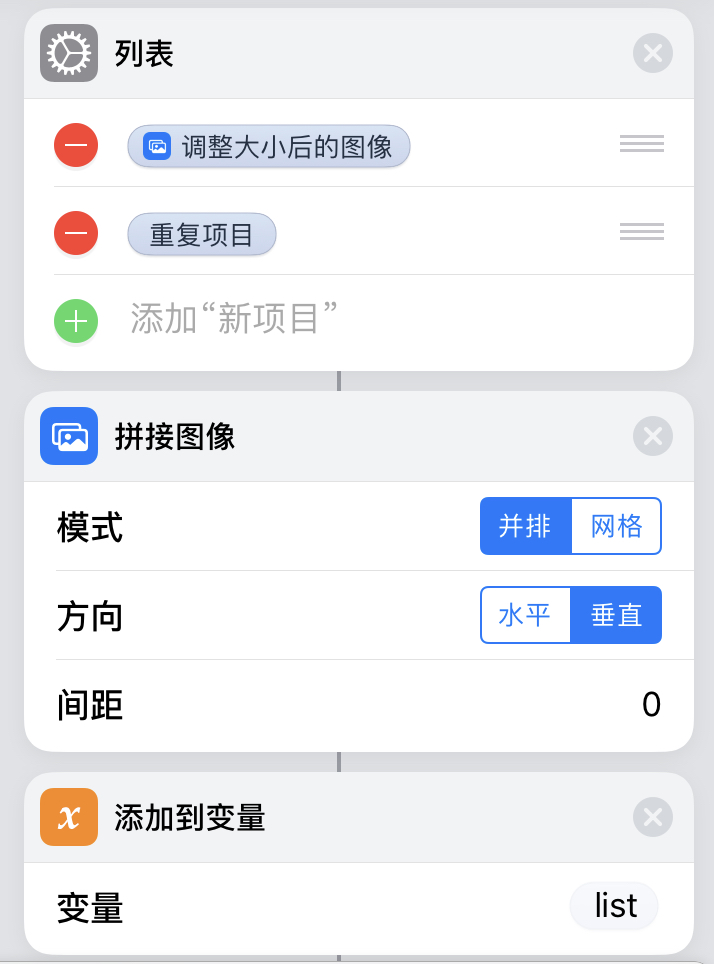

看到一张 GIF，可把我笑坏了，最后那只汪也太不给面子了吧哈哈哈哈~

好的，据说大约有 98% 的人承认被这样的 GIF 套路过，还有 2% 的人被套路了却不承认（我瞎编的数）。机智如你，看到这样的 GIF 还是会傻乎乎地一直盯着看，为什么呢？

你可能注意到了：这是因为 GIF 图片是可以无限循环的。GIF 图实则可看做是一个反复轮播的图片序列，序列中的每一幅图称作「一帧」，只要巧妙地设置起始帧与末尾帧就能使整个 GIF 无缝循环到天荒地老。这个特性在制作上面的整人图时有奇效，但在某些应用场景中却不然。

许多写文章的同学知道有「一图胜千言」的说法，在文章中引入动态内容（比如视频、GIF）来辅助表达可以达到事半功倍的效果，例如少数派的[这篇文章](https://sspai.com/post/47022)，利用 GIF 把浏览器的新特性展现得清清楚楚。可是当 GIF 过长，或者没有明显的起始、结束标志（就像文首那样）时读者可能会产生一种焦虑感：这个 GIF 什么时候完？**我到底是不是已经看完一遍了**？ 

视频却没有这个问题，这是因为多数视频播放器是有**进度条**的。进度条，即使是假的进度条，也能有效地缓解观看者的焦虑感。 例如上面提到的那篇少数派文章，你是否注意到了里面的 GIF 就有进度条呢？

有了这个点子就好办了。其实实践的原理也并不复杂：假如某个 GIF 共有 n 帧，那么播放到第 i 帧时，其进度（以小数计）就应该是 i÷n。我们考虑往这一帧上添加一个进度条，设帧宽度为 width，进度条的长度就应该是 width×i÷n，是不是？具体的实现方法有许多，可以使用 Photoshop 等专业软件来做，本文介绍一种简单的方法：利用 iOS 12 中内置的应用「捷径」来实现。

**动作链接**：[点击下载](https://workflow.is/workflows/bac74b4296824ca1b81e3b7ac61fb369)，使用方式：点击链接导入这个动作，运行它并从相册选择需要处理的 GIF 即可，最后的结果会保存回手机相册。

下面我来讲解一下如何一步步制作并优化这个动作，以供参考。

## 动作解析

### 需求

明确需求是（功利性地）做任何东西之前的必须步骤。这里我们的需求是：制作一个动作，它的输入是从相册选择的一张 GIF，输出则是一张带有进度条的 GIF。

### 制作

过程原理在前文已经讲明了。最为关键的步骤是：提取出 GIF 的每一帧，在每帧上叠加合适长度的进度条，然后再把处理后的帧拼接成新的 GIF。

iOS 12 内置的「捷径」应用是 iOS 平台著名效率应用 Workflow 的继任者，里面提供了许多基本的功能模块，用户可自由组合这些模块来实现相对更复杂的需求。在本例中，捷径提供了四个最为关键的动作：Get Frames From Image 、Resize Image、 Combine Images 与 Make GIF。

- Get Frames From Image 动作的输入是一张 GIF，运行后可以提取出 GIF 的每一帧，得到一个包含了多张图片的列表（list）。
- Resize Image 动作的输入是一张图片，它可以将这张图片缩放到设定的尺寸。本例中就用它来制作进度条。你想到应该怎么做了吗？所谓进度条，其实就是一张细长的纯色图片，它可以由任何一张纯色图片制得：只要让它的宽度是进度条长度，高度大约两三个像素即可。
- Combine Images 动作的输入是一个图片列表[^其并不一定是图片列表，后文会聊到这个问题]，它的作用是拼接列表中的图片，纵向或横向皆可，并输出拼接后的图片。本例中就用它来给每一帧加上进度条。
- Make GIF 的输入是一个图片列表，它可以将这个列表中的图片合成为一个 GIF。

不难画出完整的流程图：

### 分析与改进

按照以上流程图制作的动作固然可以使用，但是有一个很大的缺点：它要求使用者相册中有一张纯色图片以备使用，这……太不优雅了。再说，如果你分享给你女朋友，她却发现不能直接用还要有什么纯色图，她哪里去找什么纯色图？你怎么这么敷衍？你是不是不爱她了？

一种解决思路是：运行前检测使用者设备上有没有这个纯色图片，若有，那就继续运行，若没有，则利用 Get Contents of URL 临时下载，并存储备用。存储的位置若可能的话，最好不要是相册，以免污染别人的照片库。很自然的，iCloud Drive 是一个绝佳选择。因此，流程图的前半部分变成了：

好的，这次女朋友不会夺命三问了。但是等等……若是女朋友手机没网或者提供这个纯色图片的服务器挂了呢？虽然确实不是你的问题，但是女朋友仍然有可能迁怒于你，怕怕。我们要把隐患扼杀在摇篮中。

究其原因，一切都是因为这个动作需要引用外部的资源：一张纯色图。如果它能直接内置到动作里就好了。能不能办到？当然可以。

捷径应用里内置了一个动作：Base64 Encode，有编程经验的同学应该就明白了。简单地说，Base64[^这里的原理涉及到文件的编码问题，更细致的内容参考：https://en.wikipedia.org/wiki/Base64]可以把一个二进制文件转换为一串纯文本，也能从文本中解码出原来的文件。既然动作不能存储图片文件，但存储文本却是可以的呀！因此在最顶部放一个 text 块，里面填写上纯色图的 Base64 编码，运行时再从这里解码得到纯色图片即可。应该说到这里，这个动作完成度算是比较高了。

再来看看带进度条的 GIF：

不能整人了，不开心￣へ￣。

## 延伸

动作的制作与优化上面就聊完了。这部分是一些额外的讨论和抛砖引玉的内容。

### Add to Variable

在前面的流程图中，我很自然地使用了 Add to Variable 这个动作，来临时保存需要拼接的进度条和某帧。捷径应用中对这个步骤的简介是：

> Appends this action's input to the specified variable, creating the variable if it does not exsist.
>
> This allows you to make a variable hold multiple items.

也就是，将这个步骤的输入追加到某个变量的末尾。值得注意的是，并不**与某个变量合并**，而是**追加**。举例来说，如果你把一段文本通过这个步骤 add 到另一个变量（也是一段文本）后，并不会得到一段包含了这二者的文本，而是得到了一个「列表」，里面分别包含了两段文本。

听上去很绕。但我们只需要知道，这个步骤的输出一般会是一个列表。Add to Variable 这个步骤的作用可归结于**暂存多个变量，以待后续处理**。为什么这么说？因为「列表」其实是一种特殊的变量——存储变量的变量。

#### 暂存变量

以前使用过这个应用的玩家可能知道，应用中有一个叫做 List 的步骤，可以在运行过程中保存几个变量以供后续处理。在本例中，两次 Add to Variable 然后拼接为新的一帧这一段完全可以这么改写：

那么 Add to Variable 还有什么存在的意义？

你是否注意到，虽然 List 这个动作在这里的效果要比 Add to Variable 强，使得动作看起来更简洁，但它有一个特点：容量是固定的[^并不是绝对的，有兴趣的读者可以考虑一下如何使用 List 来存储任何长度的内容]。在制作这个动作时只为它预留了两个位置，一个用来放进度条，一个用来放图片帧，那就不能再运行过程中存储更多的东西了。

当需要暂存的内容个数不定时，List 动作就力不从心了，这时就轮到 Add to Variable 上场。不论有两个、五个还是十个一百个变量，Add to Variable 都能老老实实地帮你存好。本文中要处理的 GIF 帧数不一，因此即使经过上图的改写，与进度条拼接后的帧仍然要使用 Add to Variable 暂存最后再合成 GIF[^同样也不是绝对的，读者可以思考一下如何改写整个 shortcut，使之不使用任何的 Add to Variable 动作。这是可以做到的，但是代价是可读性、可调试性下降。制作大型的动作时不建议使用这类「奇技淫巧」]。

值得注意的是，列表中的数据类型无需是相同的，你可以把图片、音乐、文本等等内容添加到一个 List 里。暂存多个变量的部分至此结束。

#### 以待后续处理

不论使用 List 还是 Add to Variable，你现在得到一个列表了。你能想到对它进行什么操作？抽象地说，操作可分为对列表中的所有元素处理，或者对其中的某些进行处理。本文中拼接列表中的图片属于前者。

看一个属于后者的例子。所谓「对某些进行处理」，无非是用户手动选择某些，或者自动过滤出某些。少数派 Shortcuts Gallery 中有个[影评日记](https://www.icloud.com/shortcuts/192ef048349942f2b9b04e5d1d73bed8)的动作就是就是这样的。这个动作比较复杂，我不具体介绍里面的内容，它的流程是这样的：从豆瓣根据某个关键字搜索电影，获得前 5 个搜索结果，提取每个搜索结果的重要信息合成一个 List，供使用者选择，再根据选择的结果从豆瓣请求更为详细的信息然后进行后续处理，有兴趣请下载影评日记这个动作看看。

#### 这里有一个坑

回到上面那个流程图，若是把循环中的第一个 Set Variable 也改成 Add to Variable，会发生什么事情？大家可以试一试。

结果就完全不对了，但看起来没有什么逻辑问题啊？就是添加到 temp 变量嘛，虽然循环开始时没有这个变量，但苹果的文档也说了，没有 temp 变量时会自动创建的。

这里的问题在于，Shortcuts 中的变量是全局有效的。因此在下一次循环开始时，上一次的循环的 temp 变量仍然是有效的，Add to Variable 是在上一次运行结束时 temp 变量上追加，自然就不对了。原动作中的 Set Vriable 相当于是清空了 temp 变量，然后把它的值设为预定的值，如果这个位置非要使用 Add to Variable 的话也不是不可以，那么就需要在每个循环末尾添加两步：Nothing→Set Variable(temp)，这相当于手动清空了 temp 变量。

### Combine Images

前文提到，Combine Images 动作的作用是把一个列表里的图片拼接起来。动作上有三个选项：Mode，拼接方式，可选并列或者网格；Direction，方向，可选水平或者竖直，当 Mode 是网格时该选项无效；Spacing，间隔，即拼接时两张图片之间的距离。

本文中，Combine Images 的输入是一个图片 list，但我在脚注里说，不一定非得如此。你可以试试在一个 list 中放一段文本和一张图片，然后把这个 list 传给 Combine Images，看看会出现什么结果？

没错，动作会将文本转换为图片然后把它们拼接起来，对习惯了严格声明数据类型的程序员来说这看起来是很奇妙的，虽然最终的效果可能不是很好（尺寸会变得很奇怪）。

关于这一点在苹果的 [Shortcuts 文档](https://support.apple.com/zh-cn/guide/shortcuts/welcome/ios)中有详细说明：

> When an action expects one type of content and you pass it another type of content, the Content Graph automatically converts that content to the appropriate type. 

也就是「自动类型转换」。「捷径」应用的前身是 Workflow，可见这个开发团队为了使任何人都能顺畅地使用这个 app 在背后做了多少工作。要知道，对数据类型、程序代码都一无所知的用户会制作出无数千奇百怪、奇思妙想的动作，要考虑到所有的意外是极为困难的，还不能简单地报错、抛出异常，因为这样太容易「劝退」了。正是开发团队在背后做的工作使我在使用这个应用时屡屡觉得惊喜，这让我想起了小时候偶得一套螺丝刀，才发现原来我仅靠自己的力量就能拆掉那么多东西（误），那是一种发自内心的喜悦。