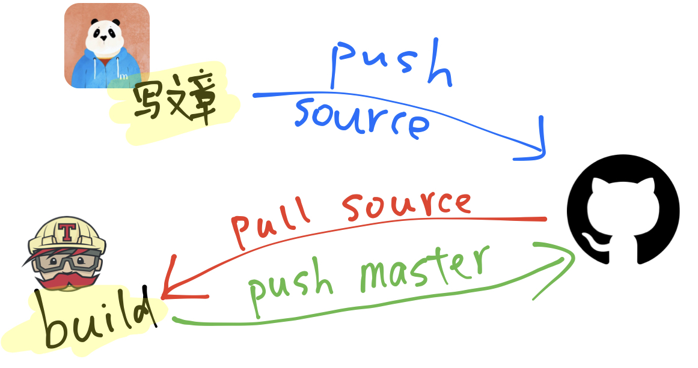
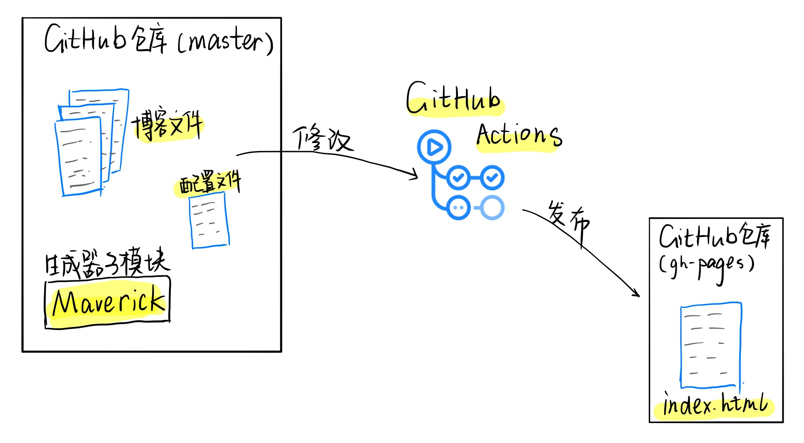

这篇文章分享我目前的博客工作流：基于 GitHub 与 [Maverick](https://github.com/AlanDecode/Maverick) 获得一站式的博客体验。借助这个自动化流程，能够达到：

* 超酷超方便的图片管理（当然了，Maverick 嘛）
* 博客版本管理（当然了，GitHub 嘛）
* 在任何设备上写博客，包括浏览器（当然了，GitHub 嘛）
* 无需值守的自动化构建（当然了，GitHub 嘛）
* **免费、超快的全球 CDN！**（当然了……jsDelivr 嘛！）
* 不需要在本地安装什么第三方程序（不过要在本地写文章的话，Git 还是需要安装一下）

目前，本博客与 [无知识](https://wiki.imalan.cn) 都跑在这个流程上。这篇文章在 iPad 上写成，内容与发布部分并没有碰过代码，也没有开过终端。虽然本文的工作流是针对 Maverick 优化的，但理论上它适用于任何可以托管在 GitHub Pages 的静态博客。只不过若要完全达到本文效果还需要进一步调教。请多关注原理。

[notice]用以保存与构建本博客的仓库是 [Alandecode/site-Blog](https://github.com/AlanDecode/site-Blog)。为了方便各位自己尝试，我还创建了一个[示例仓库](https://github.com/AlanDecode/Blog-With-GitHub-Boilerplate)，请各位把这个仓库 fork 到自己那里，然后按照 README.md 的步骤完成一遍，就知道整个流程到底是怎样的了。本文更多的还是关注原理与细节。[/notice]

## 为什么要用 GitHub 管理博客源文件

**安全、持久以及版本管理**。许多写博客的人不重视这一步，总爱把源文件放在电脑上某个随意的角落，或者直接发布到博客程序中而不加备份。依我看，这都是没有远见的做法。一旦坚持得久了，老旧的文章就是一笔财富；但电脑会坏，服务器可能被误操作删库，这都会造成无法挽回的损失。除源文件（专指文本内容）外，对图片等附件的管理也有这个问题，并且更加棘手。

更好的实践是把源文件放在诸如 Dropbox、iCloud 之类带有版本管理的服务里，以减少丢失的可能；当然，也包括 GitHub。**最好不要**把图片等附件托管到任何在线服务并在源文件中引用，而应该保持它们与源文件位于同处。也就是说，你的所有内容应该是自给自足的，而不依赖第三方的服务。

> 你其实完全没有必要使用第三方图床引用图片。大多数的编辑器都支持通过相对路径或者绝对路径引用与预览本地图片，甚至包括 GitHub。你可以在浏览器中打开这篇文章存放在 GitHub 上的 [Markdown 原文](https://github.com/AlanDecode/site-Blog/blob/master/src/%E5%81%B6%E5%B0%94Geek/2019-12-17-%E5%AE%8C%E5%85%A8%E4%BD%BF%E7%94%A8-GitHub-%E5%86%99%E5%8D%9A%E5%AE%A2.md)，可见所有通过类似 `./assets/img.png` 的链接引入的图片都得到了正确的展示。 

GitHub/git 天生适合这个任务。只需要新建一个仓库，把所有的文本与图片都放在里面，增删文件时提交更改并推送到 GitHub，借助不限量、不限时的版本回溯，你的内容已经相当安全了。此外，GitHub 私人仓库目前已经免费，虽然每个仓库有 1G 的容量限制，但相信我，1G 足够个人博客使用。

**GitHub 本身就是具有网页版编辑界面的内容管理系统**。与其大费周章地自己构建一套 Web 写作前端，何不使用 GitHub 现成的呢？国际大厂，值得信赖；**真正**的 GitHub-flavored Markdown 风格；而且还有大量的第三方软件可以同步 GitHub 仓库进行编辑。

另外，使用 GitHub 管理源文件是本文所述流程的基础。

## 如何在 GitHub 上托管一个网站

虽然许多人知道 Hexo 可以把网站「发布到 GitHub Pages 上」，但由于 App 的兴起，多数人都对「网站」这个概念有些模糊。这里，我简要地介绍到底什么是静态网站、网页，以及 GitHub Pages 到底是什么，它在背后做了些什么。

这里，我们只讨论最传统的网页。最传统的网页都是静态网页，在服务器上就是一个个 HTML 文件。当通过「链接」访问这个服务器时，服务器就根据链接来找到对应的 HTML 文件，把里面的内容传送到浏览器，浏览器再把内容渲染与展示到你面前。

举个例子，你通过 `https://test.com/index.html` 访问时，`test.com` 这个服务器就把位于网站根目录下的 `index.html` 文件内容发送给浏览器，让浏览器展示。由于多数网站都采用 `index.html` 这个文件名，所以很多时候就可以省略不写，直接访问 `https://test.com/` 也能获得相同的效果。

GitHub Pages 在这里其实就充当了 `test.com` 这个角色，它是一个服务器。

我们说「发布到 GitHub Pages 上」，其实指的仍然是把文件上传到某个 GitHub 仓库中，只是这里的文件就不是代码或者源文件，而是**被生成的，要交给浏览器展示的 HTML 文件**，为对应的仓库开启 Pages 服务以后，GitHub 就能在收到访问请求时把仓库里的 HTML 文件发送给浏览器展示。

目前，GitHub 上的**所有仓库**都可以开启 Pages 服务，网络流传的所谓「只能启用一个」是错误的。仓库分为两类：

第一类，仓库名形如 `<用户名>.github.io`。GitHub 会默认为这类仓库开启 Pages 服务，可以直接通过 `http://<用户名>.github.io` 访问。

第二类，其它任何名称的仓库。对这些仓库，Pages 服务可以在仓库设置中手动打开，并通过 `http://<用户名>.github.io/<仓库名>` 访问。

两类仓库都可以指定部署的内容来源，包括：

* master 分支（默认）
* master 分支中的 docs 文件夹
* gh-pages 分支

这两类仓库都可以绑定自定义域名，方法相同，在仓库中创建 `CNAME` 文件或者在设置中绑定就行。此外，**私有仓库也可以开启 Pages 服务**，这十分适合用来发布博客，设想在 master 分支中存储源文件，是只自己可见的；将生成的网站发布到 gh-pages 分支，是公众可见的。这是兼具安全与便捷性的方案。

## 如何使用 GitHub 自动构建与发布博客

已经有很多人摸索出了利用 GitHub 托管与自动构建的流程，例如我曾写过的 [使用 Travis CI 自动生成与部署 Hexo 博客](https://blog.imalan.cn/archives/213/) 就能针对 Hexo 博客达到该目的。这些方法本质上是一个这样的流程：当更新文章并推送到 GitHub 时，自动通过 CI 服务发起一次构建任务，然后把生成的静态博客推送回 GitHub 上。



但是，Hexo 等生成器大多要求将博客源文件存放在某个特定的目录下，让我们无法自由地组织源文件；另外，这些生成器对图片的处理十分笨拙，不能应对引用本地文件的情景；当然，它们也无法达到本文稍后要谈到的 CDN 加速效果。

开源的 [Maverick](https://github.com/AlanDecode/Maverick) 是一个与 Hexo 类似的博客生成器，不同的是它针对源文件与图片管理做了大幅改进，可以从任何目录寻找源文件，并且可以自动处理引用本地图片的情况。那么，如何将它结合到流程中呢？

这里，我想用啰嗦一点的方式讲解，并且穿插介绍一些技术上的基本概念。别怕，不难。

### 需求梳理

为了有的放矢地进行设计，我们先明确需求。大致上，要达到以下目的：

* 使用 GitHub 管理自己的博客源文件（一堆 Markdown 文本文件），以及文件中引用的图片
* 在更新内容时，例如增、删、改博客文章，希望 GitHub 能察觉到并自动更新托管在 GitHub Pages 的博客网站
* 静态博客生成器与博客源文件应该分离开来，并且同样能够被版本管理，以及方便地更新。

第一条比较简单，之前已经谈过了。现在先来说第二条。

### 基于 GitHub Actions 的自动构建

其实，监视仓库并在有改动时自动执行一系列动作是非常广泛的需求。软件开发工作中，经常需要对新添加的代码随时进行测试，或者进行部署，都是通过这样的自动化流程实现的。实际上这类服务还有个{{专门:莫名其妙}}的名字：「持续集成（Continuous Integration）」，简称 CI。



此前，最广泛使用的 CI 服务当属 [Travis CI](https://travis-ci.org)；现在 GitHub 也推出了自家的 CI 服务 [GitHub Actions](https://github.com/features/actions)。相比起 Travis 来，GitHub Actions 更加 「native」，经我测试似乎也更敏捷、快速；此外，还能直接引用别人写好的规则。本文就基于 GitHub Action 描述构建流程。

当仓库收到新的更新（push）时，GitHub 会根据仓库中 `.github/workflows` 文件夹下的 YML 配置文件启动 CI 流程。一个简单的 YML 文件长这样：

```yaml
name: Build

# 指定只在 master 分支的 push 事件发生时执行
on:
  push: 
    branches:
      - master

jobs:
  build:

    runs-on: ubuntu-latest

    steps:
    
    # 首先拉取最新的代码，这里直接使用已有的规则
    - uses: actions/checkout@v2

    # 安装生成环境，也是已有的规则
    - name: Set up Python 3.7
      uses: actions/setup-python@v1
      with:
        python-version: 3.7

    # 安装依赖包
    - name: Install Deps
      run: |
        pip install -r requirements.txt

    # 进行构建
    # 这一步需要根据实际的构建方式修改
    - name: Build
      run: | 
        make all

    # 把构建的结果推送到 gh-pages 分支
    # 这里也直接使用别人写好的规则，只需要自定义几个设置项（env 与 with）
    - name: Deploy to GitHub Pages
      uses: docker://peaceiris/gh-pages:v2
      env:
        # 注意这里的 PERSONAL_TOKEN，由于默认的 GITHUB_TOKEN 无法触发
        # 公共仓库的 Pages 构建，因此需要在账户设置中生成 TOKEN，并添加到
        # 本仓库的 secrets 里
        PERSONAL_TOKEN: ${{ secrets.PERSONAL_TOKEN }}
        PUBLISH_BRANCH: gh-pages
        PUBLISH_DIR: ./dist
      with:
        emptyCommits: false
```

上面这个示例文件在 master 分支收到更改时做了这几件事：

1. 拉取最新的代码
2. 安装环境，例如 Hexo 所需的 Node，或者 Maverick 所需的 Python 等
3. 安装依赖包
4. 执行构建
5. 把构建结果推送回 gh-pages 分支

虽然后文我们要对这个流程进行一定修改，但大框架并不会变。可见，通过 GitHub Actions，在增删、修改文章时自动更新网站是可行的，只需要编写对应的配置文件即可。

考虑到普适性，这里我就不展开细说这个配置文件的写法。许多静态博客生成器都是通过命令行来生成网站的，因此其实在 Build 这一步中填入对应的命令即可。

### 将生成器纳入版本管理

将生成器一并纳入版本管理不是必须的，因为我们总可以在生成站点时临时安装最新版的生成器。然而这样一来有几处不便：

1. 无法控制要使用的生成器版本。我们当然不一定总是想要用最新版，特别是考虑到有时候生成器本身升级可能导致一些不兼容的问题
2. 不能在升级生成器的时候触发网站更新。由于生成器并不在我们的版本管理系统中，若博客内容没有修改，即使生成器更新了也无法触发相应的网站更新

Git 子模块（submodule）是解决以上问题的直接途径。Git 子模块专门用于处理一个项目依赖于别的项目的情况，在本文，也就是博客这个项目依赖于生成器项目。生成器作为子模块被引入博客项目中。

这里简要介绍添加、更新、管理子模块的方法。假设现有一仓库，名叫 `ParentProject`，作为父项目，我们要在这个仓库里引入 Maverick 作为子模块：

```bash
cd ParentProject
git submodule add https://github.com/AlanDecode/Maverick.git

git add .
git commit -m "add submodule Maverick"
```

此时 Maverick 就会出现在 `ParentProject` 文件夹下，并纳入父项目的版本管理。注意，这时候子模块的版本就**锁定**在了添加它时的那次提交，如果子模块有更新，这边要怎同步更新呢？

```bash
cd ParentProject/Maverick
git pull --rebase
cd ..

git add .
git commit -m "update submodule Maverick"
```

也就是：先进入子模块文件夹，拉取新的提交，然后切换回父项目，提交更改。这样一来父项目中的 Maverick 更新到了最新的一次提交。

这样做的好处很明显。由于子项目只是作为一个引用出现在父项目中，可以很方便地升级降级，而且不会与父项目的文件混淆。这个技巧其实可以用在许多的生成器上，只要生成器本身是使用 Git 开源的。

### 把这些步骤串联起来！

到现在为止我们已经将需求点各个击破，但似乎有点「只见树木不见森林」。如何基于上面的各个技巧构建一套流程呢?

[notice]再次提醒，为了方便各位自己尝试，我创建了一个[示例仓库](https://github.com/AlanDecode/Blog-With-GitHub-Boilerplate)，请各位把这个仓库 fork 到自己那里，然后按照 README.md 的步骤完成一遍，就知道整个流程到底是怎样的了。本文更多的还是关注原理，而不是手把手教程。[/notice]

现在，我们已经有了一个仓库，里面存放了我们的博客源文件以及图片等等，假设这些都放在 `src` 文件夹下；以及通过子模块引入了 Maverick，放在 `Maverick` 文件夹下。此外，还有针对站点的设置文件 `conf.py` 放在仓库根目录下。当这个仓库收到任何更改，不论是修改源文件，还是更新子模块，还是修改配置文件，GitHub 都能探测到并根据预先设定的规则执行任务：启动一次构建，构建源文件是仓库 `src` 文件夹下的内容，配置文件是仓库根目录下的 `conf.py` 文件，生成的结果要推送回仓库的 gh-pages 分支。

应该相当明了吧。这个构建过程所使用的 GitHub Actions 文件，请参考 [ci.yml](https://github.com/AlanDecode/site-Blog/blob/master/.github/workflows/ci.yml)。

接下来聊聊 CDN 的问题。

## 如何自动加上 CDN 支持

不，我说的当然不是 CloudFlare。

而是 jsDelivr。jsDelivr 是一家全球 CDN 服务商，特别值得一提的是，在官网上它宣称

> jsDelivr is the only public CDN with a valid ICP license issued by the Chinese government, and hundreds of locations directly in Mainland China.

它的速度在中国相当不错。而且还有一个重要特性：支持加速来自 GitHub 仓库的文件！只要构造一个类似这样的 URL：

```
https://cdn.jsdelivr.net/gh/<用户名>/<仓库名>@<分支名>/<文件路径>
```

例如：

```
https://cdn.jsdelivr.net/gh/AlanDecode/site-Blog@gh-pages/favicon.ico
```

就能直接访问对应文件。这一点可以被我们加以利用，用以加速博客上的 CSS、JS、图片等静态文件。

要想实现这一点，不免要求生成器自身能够处理这些链接。Maverick **自带了这个功能**。它可以自动为博客中引用的本地图片加上 CDN 支持，同样也支持 CSS、JS 等文件。

Maverick 所做的，就是根据设置的用户名、仓库、分支生成对应的链接，并在生成网站时替换原来的链接。我在文首倡导将图片放在本地也有这个原因：使生成统一的 URL 成为可能。

对了，使用这个方法要求仓库是公开的，否则 jsDelivr 无法获取要加速的文件。

## 结语

折腾出这一套流程工作量不小。考虑到我还专门自己写了一个生成器（就是 Maverick），这其实是相当庞大的工程。

虽然过程曲折繁复，但最终的结果却是简约的，甚至可称得上傻瓜式。这一切都是为了让写博客再轻松、方便一点。

我猜许多人看到这么多字就已经不耐烦了。但是无妨，你只要知道一点：我把这个文章的成果总结成了一个[仓库](https://github.com/AlanDecode/Blog-With-GitHub-Boilerplate)，这是一个可以立即上手的模板，你只需要把它 fork 到你的账户下，然后根据 README.md 里的步骤操作一遍就知道该怎么用了。请务必一试。
