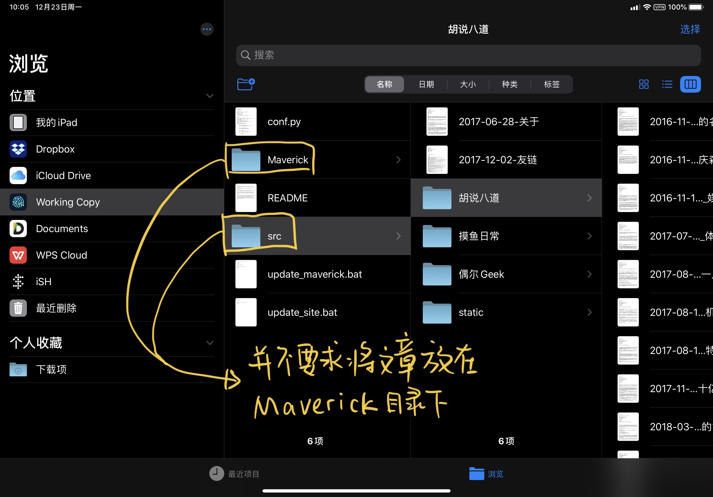
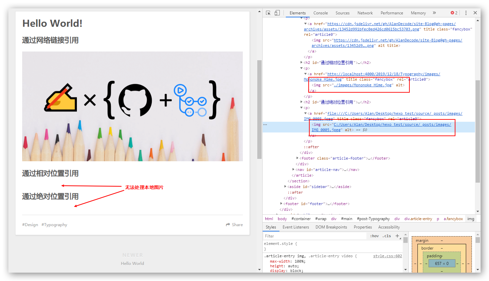
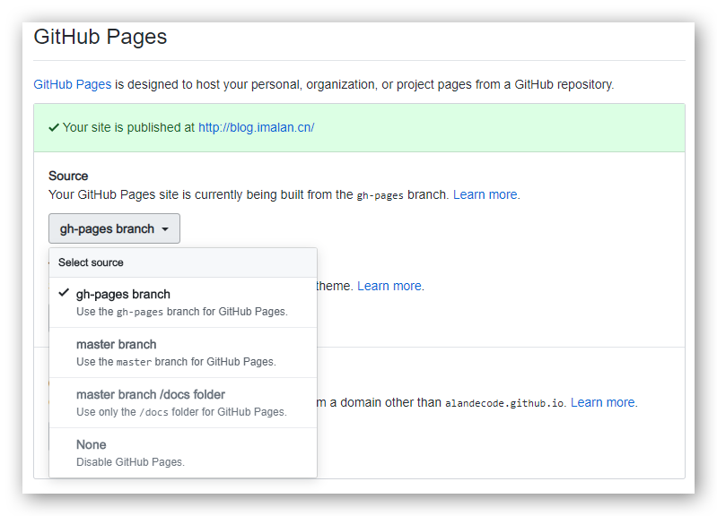
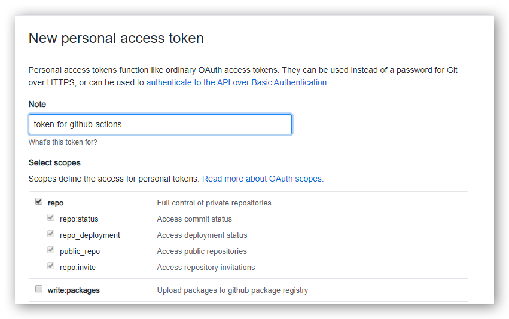
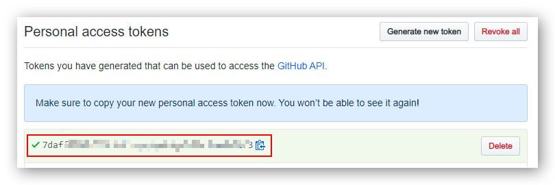
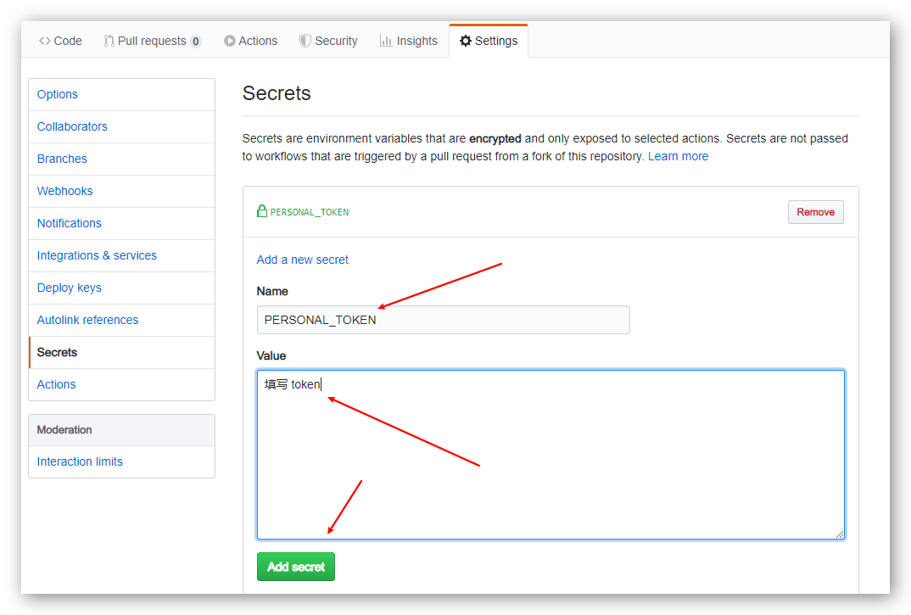
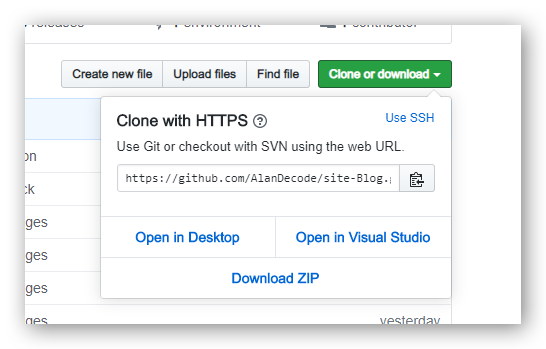

除了作为程序员们的分享与协作平台外，GitHub 还是一个绝佳的知识分享平台。尤其是近几年静态博客逐渐兴起，借助 GitHub 的 Pages 功能托管个人博客成为了经济实惠、广受欢迎的一种方案，我派也有许多文章介绍了如何基于 Jekyll、Hexo 等工具将自己产出的内容部署到 GitHub 上。

我自然也不例外：在尝试了 WordPress、Typecho 等诸多建站工具后，如今决定回归静态博客。跟以往不同，这一次我认真总结了使用各个博客系统时遇到的问题与摸索出的一些技巧，把这些经验糅合在一起，最后的成果便是这篇文章的主角：一个名为 [Maverick](https://github.com/AlanDecode/Maverick) 的静态博客生成器，以及一套基于 Maverick 的博客写作自动化流程。借助这套流程达到了这些效果：

* 方便的图片管理
* 博客版本管理
* 在任何设备上写博客，包括浏览器
* 无需值守的自动化构建
* **免费、超快的全球 CDN！**
* 不需要在本地安装 NodeJS 这类运行环境（若要在本地写文章，需要安装 git）

若把 Markdown 文本和引用的图片比作面粉、鸡蛋，若要把它们做成可口的蛋糕（静态博客），一般而言还需要一间厨房（比如你的电脑）以及一个烤箱（比如 Hexo）。在本文中我利用了 GitHub 提供的自动化服务 [GitHub Actions](https://github.com/features/actions)，使博主可以专心提供更优质的「原料」而不用操心「烤制」的过程 —— 在这里，GitHub 充当了厨房与烤箱的角色。


本文首先简要介绍使用 GitHub 写博客以及自己写生成器的若干原因；为避免枯燥乏味，之后通过一个逐步教程向大家介绍这个流程的操作方法，穿插一些基本概念的讲解。

## 为什么要使用 GitHub 写博客

除了免费、稳定之外，使用 GitHub 写博客还有诸多好处。

GitHub 的核心是 git，一套专业的版本管理系统。不限数量不限时间的版本回溯功能让内容管理十分便利；托管至 GitHub 上更是让安全性上升了一个等级。许多人写博客的不重视这一步，总爱把源文件放在电脑上某个随意的角落，或者直接发布到博客程序中而不加备份。依我看，这都是没有远见的做法。一旦坚持得久了，老旧的文章就是一笔财富；但电脑会坏，服务器可能被误操作删库，这都会造成无法挽回的损失。

除文本内容外，对图片等附件的管理也是相当棘手的问题。由于 Markdown 能力有限，人们倾向于把图片上传至第三方图床，然后在文章中通过链接引用。然而这算不得可靠的方案。今年年初就由于新浪突然对自己的图片服务增加访问限制，一众使用新浪图床的博主都只能叫苦连天。最好的方法是保证 Markdown 文本文件与图片文件位于同处，文章内通过相对位置（例如 `./images/1.png` 这样的链接）引用图片，自给自足，以最大程度保证持久性与可访问性。

许多人可能没有意识到，GitHub 自身就是一个优秀的带有 Web 界面的内容管理系统（CMS）。一个博客系统应该有的功能，诸如对内容的增删改查，GitHub 都能轻松做到；通过将仓库克隆到本地，还能自由使用其它优质的编辑器进行写作。这个过程没有繁琐的拷贝、导入、导出，其体验是一致且连续的。

此外，GitHub 是十分开放且灵活的平台，从下文你将看到利用这个平台所提供的的自动化解决方案（GitHub Actions），写博客、发布博客这件事可以做到多么简便。

## 为什么我要自己写一个生成器

当然是因为现有的生成器，例如 Jekyll 和 Hexo 等，都多多少少有些不太便利的地方。

现有的生成器大多会要求将源文件以一定的目录结构放在指定的位置，例如生成器目录下；此外，它们不太能处理通过相对链接引用图片的情景。以我去年写的文章 [使用 Travis CI 自动生成与部署 Hexo 博客](https://blog.imalan.cn/archives/213/)为例，便不得不将生成器自身也纳入 git 版本管理，实在算不得优雅的解决方案。

Maverick 也是针对 Markdown 文本的静态博客生成器，但是与 Hexo 等有几点不同。

首先，Maverick **不限制**源文件的存储位置，你可以把文章目录放在电脑上的任何路径下，例如 Dropbox、iCloud Drive，以便备份、同步、版本管理，以及在任何设备上用任何编辑器写作。Maverick 也**不限制**源文件的组织结构，你可以按照你喜欢的方式组织它们，按时间、按类别都可以。以 Hexo 为例，它要求把文章存储在 `hexo目录/source/_posts` 这个路径下；而此时我使用 git 管理自己的博客源文件，目录结构如图：



此外是对图片的处理。Maverick 允许在 Markdown 文件中引用**任何位置**的图片，并且都能在生成网站时合适地处理它们。若你在原始文本中通过绝对路径或者相对路径引用本地图片，Maverick 会在生成网站时自动寻找它们，把它们复制到统一的位置，并对应处理引用链接；若通过 URL 引用了远程图片，则（可选地）可以将它们下载到本地缓存，按本地图片对待。在 Hexo 与 Maverick 中分别新建一篇文章，内容如下：

```
## 通过网络链接引用


## 通过相对位置引用


## 通过绝对位置引用


```

分别执行生成，看看效果：



可见 Hexo 不能处理通过相对与绝对位置引用的图片，发布后的网页占用仍然保持原来的引用链接；


Maverick 则能自动搜索并将本地图片随网站发布，这使我们能更自由地插入图片。

此外，Maverick 支持大量静态博客生成器应该有的功能，例如 RSS 源生成、**实时搜索**、Sitemap 等；此外还包含了扩展的 Markdown 语法，提供代码高亮、行内脚注、数学公式、图片排版等常用功能。你可以在[这里](https://blog.imalan.cn/archives/194/)看到示例页面。

虽然目前还没有实现插件功能，但应该能满足个人博客需求。

## 现在，跟我一起动手实践吧

基于我[个人博客](https://blog.imalan.cn/)的实践，我将整个流程做成了一个[示例仓库](https://github.com/AlanDecode/Blog-With-GitHub-Boilerplate)，请将这个仓库 fork 到自己的账户下（点击右上角的 Fork 按钮），然后跟我一起完成余下的步骤吧。fork 之后请暂时不要更改仓库名称，保持 `Blog-With-GitHub-Boilerplate` 不变。

### 为仓库开启 Pages 服务

进入新 Fork 的仓库，点击右上角的 Settings 按钮，找到 GitHub Pages 相关设置 ，将 Source 设置为 gh-pages branch。



稍等片刻你就可以通过类似 `https://<用户名>.github.io/Blog-With-GitHub-Boilerplate` 这样的链接访问示例网站了。

虽然许多人知道可以把网站「发布到 GitHub Pages 上」，却对背后到底发生了什么不甚了解。仓库设置好 Pages 服务后，GitHub 为对应的仓库分配一个链接，当使用这个链接访问时，GitHub 就将具体的请求映射到仓库中的某个文件。例如  `https://<用户名>.github.io/Blog-With-GitHub-Boilerplate/index.html` 这个链接，对应的文件则是仓库根目录下的 `index.html` 文件，由于大家都用 `index.html` 这个文件名，因此也可以省略不写，其它链接同理。

目前，GitHub 上的所有仓库都可以开启 Pages 服务。仓库分为两类：

第一类，仓库名形如 `<用户名>.github.io`。开启 Pages 服务后可以直接通过 `http://<用户名>.github.io` 访问。

第二类，其它名称的仓库。对这些仓库，开启 Pages 服务后可以通过 `http://<用户名>.github.io/<仓库名>` 访问。

两类仓库都可以指定部署的内容来源，包括：

* master 分支（默认）
* master 分支中的 docs 文件夹
* gh-pages 分支

这两类仓库都可以绑定自定义域名，方法相同，在发布来源中创建 `CNAME` 文件或者在设置中绑定就行。此外，**私有仓库也可以开启 Pages 服务**，这十分适合用来发布博客，设想在 master 分支中存储源文件，是只自己可见的；将生成的网站发布到 gh-pages 分支，是公众可见的。这是兼具安全与便捷性的方案。

### 为仓库添加一个 token

为了后续能够通过 GitHub Actions 自动更新你的博客，我们需要为仓库添加一个 token。点击[这个网址](https://github.com/settings/tokens)，点击右上角的 Generate new token，起个名字并勾选 repo 复选框：



点击页脚的 Generate Token，新的 token 会显示出来，把它复制下来，保存好。关了这个页面你就永远也看不到它了。



回到仓库中，进入 Setting，坐标找到 Secrets 选项卡，新建一个名叫 PERSONAL_TOKEN 的 secret：



在这里，我简要介绍什么是 GitHub Actions。回顾我们的需求，是在仓库出现更改时自动更新构建与部署博客。其实，监视仓库并在有改动时自动执行一系列动作是非常广泛的需求。软件开发工作中，经常需要对新添加的代码随时进行测试，或者进行部署，都是通过这样的自动化流程实现的。实际上这类服务还有个{{专门:莫名其妙}}的名字：「持续集成（Continuous Integration）/ 持续部署（Continuous Deploy）」，简称 CI/CD。

此前，最广泛使用的 CI 服务当属 [Travis CI](https://travis-ci.org)；现在 GitHub 也推出了自家的 CI 服务 [GitHub Actions](https://github.com/features/actions)。相比起 Travis 来，GitHub Actions 更加 「native」，经我测试似乎也更敏捷、快速；此外，还能直接引用别人写好的规则。本文就基于 GitHub Action 描述构建流程。当仓库收到新的更新（push）时，GitHub 会根据仓库中 `.github/workflows` 文件夹下的 YML 配置文件启动 CI 流程。

> 💡 Note：新 fork 的仓库可能需要手动打开 Actions 服务。点击仓库顶部的 Actions 按钮，若出现 「Workflows aren't being run on this forked repository」提示，请点击「I understand my workflows, go ahead and run them」按钮。

> 💡 Note：从这里开始我们会对仓库的文件做一些修改，如果你电脑上有安装 Git，可以把仓库 clone 到本地，完成修改后提交并 push 回去；如果没有安装，可以直接在浏览器中编辑文件。

### 尝试修改一下网站设置

回到仓库首页，点击 conf.py 文件，然后点击编辑按钮：


1. 为你的网站起个名字，填写到 `site_name` 这里
2. 修改 `author`，`email`，`description` 等选项为你的内容
3. 其它选项也可以随意修改（暂时不要修改 `site_prefix` ）

点击页脚的 Commit changes，稍等片刻再访问 `https://<用户名>.github.io/Blog-With-GitHub-Boilerplate` 看是不是已经更新了。如果没有，请点击仓库标题下方的 Actions 按钮，在里面查看自动构建状态。

在这一步中我们修改了网站的配置文件，当我们提交更改时，GitHub 会监测到这一动作并自动启动预定的构建与发布流程。这个流程是如何工作的呢？

不知你注意到没有，仓库中除了 conf.py 这个文件，还有一个 src 文件夹与一个叫做 Maverick 的文件夹。其中 src 文件夹中显然是保存着用以生成站点的文章；而点击 Maverick 目录则会跳转到我的 Maverick 仓库中。这是本流程一个特殊的地方。

你想的没错，GitHub Actions 是通过仓库中的 Maverick 来生成博客的；但是这个仓库并没有真的把完整的一个 Maverick 包含在里面，而只是存储了一个指向 Maverick 特定版本的链接（通过名叫 git submodule 的功能）。如此设计可以将生成器本身也纳入版本管理，同时不与仓库中的其它文件混为一谈。通过这种方式管理生成器，升级也十分方便。

### 尝试发布新的内容

点击进入仓库的 src 文件夹，并点击 Create new file


文件名可以起 `我的第一篇文章.md`，内容参考如下：

```
---
layout: post
title: 我的第一篇文章
slug: my-first-awesome-post
date: 2019-12-17 20:34
status: publish
author: 熊猫小A
categories: 
  - 默认分类
tags: 
  - 博客
  - Maverick
  - GitHub
excerpt: Hello World!
---

这是我的第一篇文章。文章使用 GitHub 管理，并通过 GitHub Actions 自动构建与发布！
```

点击页脚的 Commit new file，稍等片刻再访问 `https://<用户名>.github.io/Blog-With-GitHub-Boilerplate`，可见新文章已经发布了。与上一步同理，GitHub 检测到了新的更改，并启动了构建与部署的自动化流程。

### 使用 jsDelivr 作为博客的 CDN 服务

先解释一下什么是 CDN 服务。CDN 全名是 Content Delivery Network，即内容分发网络。由于国内特殊的网络环境，许多把博客部署到 GitHub Pages 的同学都觉得访问速度太慢，尤其是有大量图片、大体积 CSS、JS 文件时。CDN 服务通过在全世界各个角落部署服务器来缓解这个问题，这些服务把来自源站（这里是 GitHub）的文件缓存在自己的各台服务器上，当有用户访问时则就近选择一台服务器返回结果，如此一来便能大大提高访问速度。

jsDelivr 是众多的公共 CDN 服务商中的一家，长久以来通过稳定优质的服务赢得了不少口碑。尤其值得一体的是，据它官网上的说法：

> jsDelivr is the only public CDN with a valid ICP license issued by the Chinese government, and hundreds of locations directly in Mainland China.

它的速度在中国相当不错。而且还有一个重要特性：支持加速来自 GitHub 仓库的文件！只要构造一个类似这样的 URL：

```
https://cdn.jsdelivr.net/gh/<用户名>/<仓库名>@<分支名>/<文件路径>
```

例如：

```
https://cdn.jsdelivr.net/gh/AlanDecode/site-Blog@gh-pages/favicon.ico
```

就能直接访问对应文件。这一点可以被我们加以利用，用以加速博客上的 CSS、JS、图片等静态文件。

Maverick 自带了这个功能。回到仓库首页，点击 conf.py 文件，然后点击编辑按钮。修改 `enable_jsdelivr` 如下：

```
enable_jsdelivr = {
    "enabled": True,
    "repo": "<你的用户名>/Blog-With-GitHub-Boilerplate@gh-pages"
}
```

点击 Commit changes。然后修改你刚才添加的文章，在里面插入一张仓库中的图片：

```
这是我的第一篇文章。文章使用 GitHub 管理，并通过 GitHub Actions 自动构建与发布！


```

发布后稍等片刻再访问你的网站，此时网站的图片都通过 jsDelivr 传输的。不信的话在图片上右键选择「在新标签页中打开图片」，看链接是否以 `cdn.jsdelivr.net` 开头。

要插入你自己的图片，请把图片上传到 `src/images` 文件夹里，然后在文章中使用 Markdown 语法引用即可。

### 进行更多的自定义与创作

经过以上的步骤你已经学会了自定义网站、添加文章与修改文章。接下来就该你自由发挥了。仓库中 conf.py 里面的内容都可以自定义修改，特别要注意格式，比如引号要使用英文引号之类的。针对网站的设置项请参考 [Maverick/README.md](https://github.com/AlanDecode/Maverick/blob/master/README.md)。

仓库自带的 about.md 与 Typography 都可改可删，全看你。不过请保证仓库里至少有一篇文章。

仓库`src/static` 文件夹中有一个 logo.png，这是示例 logo。你可以在这个文件夹中上传新的 logo 图片，最好是方形的图片，然后在 conf.py 中修改 `site_logo` 为 `"${static_prefix}新的logo.png"` 即可。

现在可以把仓库名称改成你想要的名字了。改了之后，记得将 conf.py 中的 `site_prefix` 设置为 `"/<新的仓库名>/"`。如果要把仓库名修改为 `<用户名>.github.io` 的形式，那么 `site_prefix` 设置为 `"/"` 即可。

### 在本地进行创作

你可以把仓库 clone 到电脑上，修改后再将修改 push 回去。为了让这个过程方便一些，仓库中自带了 `update_site.bat` 、`update_maverick.bat` （Windows用），以及 `update_site.sh`、`update_maverick.sh` （Linux、macOS用）几个文件。`update_site.xx` 的作用是在本地修改了文章或者网站配置后，将修改推送到 GitHub；`update_maverick.xx` 则用于升级仓库中的 Maverick 版本。

Windows 用户只需要双击对应的 bat 文件就可以执行，macOS 或者 Linux 用户可能首先需要在终端中给文件执行权限：

```
chmod +x ./update_site.sh
chmod +x ./update_maverick.sh
```

然后就能直接在终端运行这两个 .sh 文件了。或者使用终端直接打开它们。

> 💡 Note：关于在电脑上使用 git
>
> 如果你之前没有使用过 GitHub，那么需要进行一定的设置。如果你的电脑是 macOS 或者 Linux，git 可能是默认安装在电脑上的；如果是 Windows，则需要到[这里](https://git-scm.com/downloads)下载合适的 Git 安装到电脑上。记得安装时选中将 git 添加到 PATH。
>
> ，在弹出的窗口中输入：
>
> ```
> git config --global user.name "你的GitHub用户名"
> git config --global user.email "你的GitHub邮箱"
> git config --global credential.helper store
> ```
>
> 之后到仓库右上角的 Clone or download 那里，复制仓库链接（建议使用 HTTPS）：
>
> 
>
> 在命令行中输入：
>
> ```
> git clone <仓库链接>
> ```
>
> 若需要输入用户名密码则输入就行。这样仓库就克隆到了本地。在仓库中进行修改后，这样提交文件：
>
> ```
> # cd 到仓库文件夹后
> 
> git add .
> git commit -m "添加修改"
> git push
> ```
>
> 这样本地的修改就推送到了 GitHub。

### 绑定自定义域名

如果你有自己的域名，请在域名解析商那里将域名 CNAME 设置为 `<用户名>.github.io`，然后回到仓库，在 `src/static` 文件夹中添加一个名叫 CNAME 的文件，内容填写你自己的域名。然后在 conf.py 中修改 `site_prefix` 为 `"/"`。稍等片刻，你的网站就能通过你的域名访问了。

## 结语

折腾出这一套流程工作量不小。考虑到我还专门自己写了一个生成器（就是 Maverick），这其实是相当庞大的工程。虽然过程曲折繁复，但最终的结果却是简约的，甚至可称得上傻瓜式。这一切都是为了让写博客再轻松、方便一点。

限于篇幅，关于 Maverick 还有许多功能与设置没有在本文详述，请参照 [Maverick/README.md](https://github.com/AlanDecode/Maverick/blob/master/README.md) 开始你的探索。同时我也期待着你的反馈与建议。

最后，在个人博客式微的今天，希望大家都能再去试试这个纯粹、自由的媒介。在互联网上拥有属于自己的一亩三分地是很不错的体验。