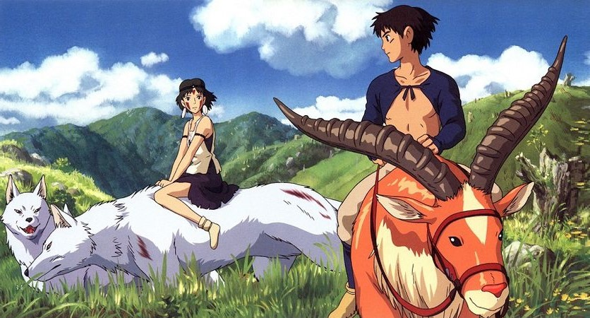
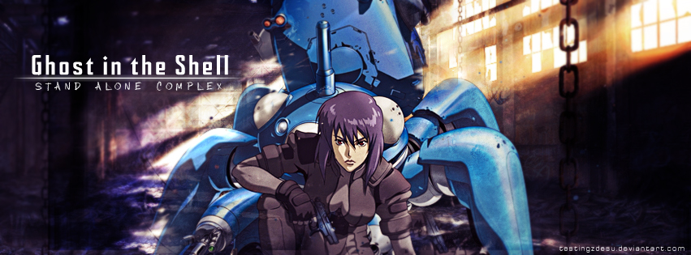
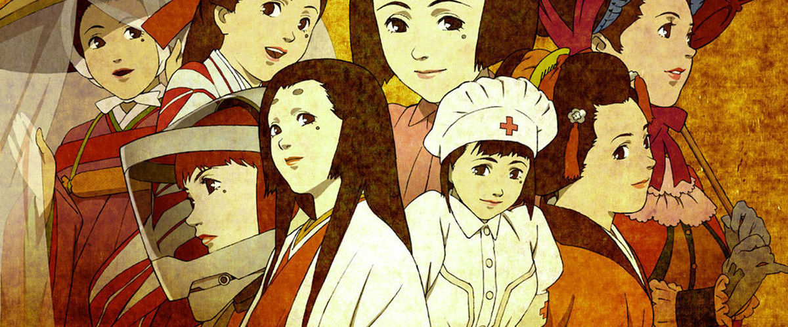
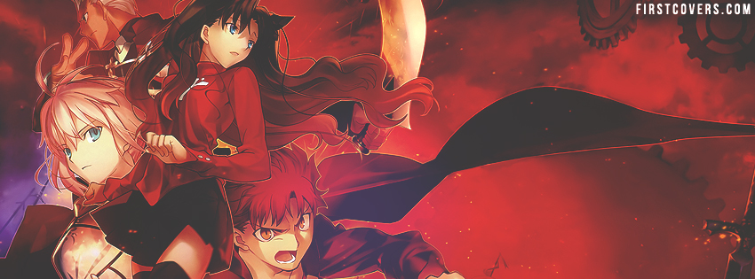

去书店时偶然在书架上看到第 52 期知日杂志，标题是《BGM 之魂》（以下简称《知日》）。封面是一张大大的坂本龙一照片，下面几行字写着泽野弘之、菅野洋子等，当时觉得十分对味，于是赶紧买下来。

差不多从大一开始就对影视剧中的配乐部分越来越看重，有时甚至会为了配乐去看电影。从直观上来说，配乐确有高下之分，但是为何好为何坏却难以总结出一个普适的道理。有的配乐好在让人根本察觉不到配乐的存在，乐音本身几乎与画面融为一体，观众每时每刻都在被乐音调动情绪而浑然不知，我认为《权利的游戏》系列配乐就属于此类；有的配乐虽十分跳脱，却不至于喧宾夺主，例如《新世纪福音战士》的配乐就是如此。有的配乐与画面情节高度契合，情节炸裂配乐也炸裂，情节抒情配乐也抒情，例如诺兰新作《敦刻尔克》；有的刚好反其道而行之，形成一种奇妙的对比，令我印象最为深刻的是《EVA：破》与《权利的游戏》中的某些片段。因此很难说哪一类配乐好哪一类就是不好，大概由于这是一门精细的艺术，再加上观众的心境各不相同，还是需要音乐家仔细雕琢。

《知日》在开始处采访了一些音乐人，一个问题是“你觉得配乐与一部作品是怎样的关系”，跑火车电台创始人 Catson 答道：

> 如果硬要讲，我觉得配乐承担了“嗅觉”的部分。人声对话是听觉，画面是视觉。“我闻到了一股危险的味道。”我觉得配乐就是这样无形地触发观看者的。

虽然从这段话看起来 Catson 更推崇“润物细无声”类型的配乐，不过也不尽然。即使是最跳脱的配乐也很难比画面和台词更引人注意，因此把配乐说成“嗅觉”确实很贴切。“闻到一股危险的味道”这个说法本身也非常有趣，危险哪有味道呢？显然是闻不到的。但人就是这么微妙，环境与心境极细小的差异就能让我们足够警觉，所谓“第六感”就是如此吧。

《知日》主要在讲日本的配乐与音乐家。日本的配乐非常多元，各种风格、混合风格都有，而且总是很新颖，出现了好多名曲。Caston 回答“日本配乐有什么特点”时说：

> 说到底，日本配乐更加“不配乐”一些。

> 而在日本的作品中，特别是在动画中，配乐更像是主要组成元素之一，常常非常突出，也常常被重复地使用，但这又恰恰形成了日本的配乐风格。

其实不光是日本，欧美也有这个趋势，但好多却有其表无其里。这让我想起某次与朋友聊天时，我说以《银河护卫队》为首的一批欧美电影在配乐上落了下乘。这些电影的配乐也极为突出，甚至播出后能直接带火某些冷门歌曲，但是作为配乐却是失败的，更有一种“剧情不够音乐来凑”的感觉。花大价钱买来版权，不分青红皂白就往上怼，这是偷懒的做法。

日本动漫配乐给了我们很多极有参考意义的示例。借此我顺便聊聊给我印象极为深刻的一些配乐吧。（聊到的某些曲子可能是 OP 或者 ED，严格说不算配乐，不过我也不想落下，就混在一起讲了。）

注意：有时候一些曲子能在我心里排上很高的名次是因为它刚好契合我听它时的心境，也许错过一点就没有那个感觉。所以也许我奉为圭臬的曲子在别人心里非常普通，这是完全有可能的，因此这篇文章仅代表我个人的好恶。

**宫崎骏 × 久石让**

聊日本配乐，我认为大多数人都不会错过《天空之城》这部动画电影中的那个熟悉的旋律，只是许多人都直接称其为《天空之城》，其实真正的曲名是《君をのせて（伴随着你）》。这首曲子由宫崎骏作词，久石让作曲，霸占了礼品店里所有的八音盒。

[Meting]
[Music server="netease" id="442770" type="song"/]
[/Meting]

> 地球(ちきゅう)は回(まわ)る 君(きみ)をのせて
>
> 世界不停转动 你隐藏在其中
>
> いつかきっと出逢(であ)う僕(ぼく)らをのせて
>
> 伴着我们，直到我们重逢的那天

去年有一个乐团在北京演奏久石让的配乐，我没有任何犹豫即买票去听，开场就是这首曲子。演奏本身不能说多好，但听得我几乎落泪。自第一次看《天空之城》已经好多年，听到这首曲子依然有难以言明的感动，这说明某些东西确实有永恒的价值。

还有一首总被人叫错名字的曲子，名叫《散步》，许多人都会错叫成《龙猫》，因为这是电影《我的邻居龙猫》中的插曲。《龙猫》这部电影我相对看得比较晚，但是却让这部作品在我心里更崇高了一些。世界上真的有龙猫，真的有精灵，只是由于我们已经变成大人了所以再也看不见了。片尾响起《散步》这首欢快又纯真的歌谣时我根本无法抑制内心的感动，多想永远保持那一份童真。

[photos]

[/photos]

让我对久石让的印象大为不同的是《幽灵公主》，一部在我心里可排在第一位的电影，它的配乐也是极为精妙。《阿西达卡战记》是交响乐的编制，听起来辽阔而纯净；《达达拉女工的主题歌》那清亮的歌声，其中蕴含的正是这部电影的主题：坚韧而不屈的生命力。在情绪低落的时候我就会听这些曲子，非常神奇，明明只是音乐而已，却能真真正正给我带来力量。

[Meting]
[Music server="netease" id="444757" type="song"/]
[/Meting]

还有《千と千寻の神隠し》、《空から降ってきた少女》、《Summer》等等说不完的名曲。真的要感谢久石让，给我留下了这么多永恒的回忆。

**鹭巢诗郎、川井憲次、平泽进**

《EVA》的配乐是公认的大胆。除开《DECISIVE BATTLE》这样标志性的配乐，也有《Komm, süsser Tod》、《Fly Me  to the Moon》这样新颖的组合。《EVA》的配乐给我印象最深的地方在于它特别喜欢使用与画面形成绝妙对比的音乐。例如正在发生人类大灭绝时却使用极纯净而美好的童声，战斗正酣却使用教堂音乐。鹭巢诗郎确实非常精于此道。

对了，新剧场版中有一个片段是第三新东京市的早晨，那一段配乐《2EM09_YAMASHITA》现在已经是我每天通勤路上的固定音乐了（很可惜现在网易云音乐上已经找不到了）。

[photos]

[/photos]

《攻壳机动队》中有一组绝妙的配乐，名叫《傀儡谣》，由三首组成：《謡 I - Making of Cyborg》，《謡 II - Ghost City》、《謡 III - Reincarnation》，出自川井憲次之手，唱法非常特别。当时押井守要求川井憲次一定要把太鼓加入其中，川井憲次于是从祭祀音乐中受到启发，以人声为主旋律，辅以太鼓、神乐铃，写成了《傀儡谣》系列。关于《谣》中特别的唱法，据网上说来自中国先秦时期的「鬼音」，在唐代盛行后流入日本，现在我国已失传了，也是相当有趣的八卦。不过很多人对川井憲次的印象并不来自《攻壳机动队》，因为川井憲次也为另一部作品配乐：《Fate/stay night》。

[Meting]
[Music server="netease" id="445290" type="song"/]
[/Meting]

第一次听到平泽进的配乐是在今敏的作品《千年女优》中，其中的一曲《縱列風》一下就抓住了我的注意，无法想象这是《千年女优》这样的作品会有的配乐，让人印象非常深刻。

[photos]

[/photos]

之所以把这三者放一块儿说，是因为我觉得他们的配乐都是比较跳脱的类型，后二者还有些实验性质在里面。日本配乐的多元化就表现在这里，时常让人感到惊喜。

**泽野弘之、小林未郁、Aimer**

这三者大概是最为人所知的为日本动漫配乐的音乐家了，他们本身也很爱合作。前二者合作的《βios》名气自不必说，Aimer 为《Fate》系列演唱的《Brave Shine》有多火爆大家都知道。小林未郁和 Aimer，尤其是 Aimer，声线非常特别，辨识度超级高。

这三位似乎都很精于“燃曲”，配上中二气质十足的作品总是非常合适。泽野弘之这个人产出非常稳定，不会出现突然作品崩掉的情况。他的曲子有个特点，曲名都是乱七八糟的，所以有个段子说他的曲名使用脸在键盘上滚出来的，《知日》里面采访泽野时他回答：

> ……当他们几年后再把专辑拿出来听的时候，我希望他们不要因为歌曲的名字，而是通过自我的感觉享受歌曲。比如说，我为一首歌曲取了曲名叫“战斗”，这首曲子的感觉就会被限制，让人产生固定的印象。所以我取了这样让人看不懂的名字，让听众自由自在地感受音乐。不过总不能只用数字来命名吧，这也太没意思了。所以我会根据企划书和作品本身的人物等相处一些特殊的歌名。

原来是这样，哈哈。

前面提到《Fate》系列的一些配乐是由川井憲次完成的，也有让人印象很深的乐曲，比如：《騎士王の誇り（骑士王的荣耀）》。《Fate》系列不愧是现象级的，不仅在游戏、动画行业创造了各种各样的记录，音乐也是数一数二。

[Meting]
[Music server="netease" id="448119" type="song"/]
[/Meting]

[photos]

[/photos]

**漫谈其他**

我大部分都在说二次元的配乐，因为确实我接触二次元的部分多一些。出自《龙珠》的经典歌曲《摩诃不思议》可以说是一代人的回忆；和田光司去世时有许多人把《Butter-Fly》找出来听以至于泪目，这是音乐的力量，也是回忆的力量。《头文字D》中的《Rage Your Dream》；出自《火影忍者》的《動天》、《ブルーバード（青鸟）》；大野克夫的经典名曲《「名探偵コナン」~メインテーマ》；《灌篮高手》中的《あなただけ見つめてる》；出自《Fate/Zero》的《満天》……这些承载着我无数回忆的曲子根本说不完。

不过大概你也看出来了，上面说的那些曲子大都是 OP 或者 ED，这类歌曲容易被传唱，要说配乐恐怕还是《名侦探柯南》中的那几首经典比较让人印象深刻。我发现现在的作品很容易出热门单曲，但是配乐的质量却有所下降。不过当然也有例外，比如 2018 年 4 月番《MEGALOBOX》的同名配乐就非常不错，与番剧本身的特质高度契合，我认为是配乐中的上乘。《白色相簿2》中也有值得一听的配乐，例如《届かない恋》，这也是很有名的曲子了。

[Meting]
[Music server="netease" id="2446258148" type="playlist"/]
[/Meting]

除开二次元，其实三次元也有很多优秀的日本音乐人与配乐作品，其中我最推崇的还是坂本龙一。坂本龙一为电影《圣诞快乐，劳伦斯先生》作的同名配乐以及他为电影《末代皇帝》作的配乐《Rain》在我看来都是上乘。话说坂本龙一还为《荒野猎人》配乐，不过我没看过这部电影，就不多说。

------

我意识到这么写下去这篇文章就会很长很长了……其实以一两句话来描述一部作品或者一个音乐人的配乐是根本不够的，因此本文只能算是粗略地罗列了我所喜欢的一些作品。

配乐是一个很大的话题，如果有机会的话，希望能够多写一些文章认真聊聊那些有趣的配乐与厉害的音乐人。不过目前还是到此为止，接下来我得出门去溜达溜达了。