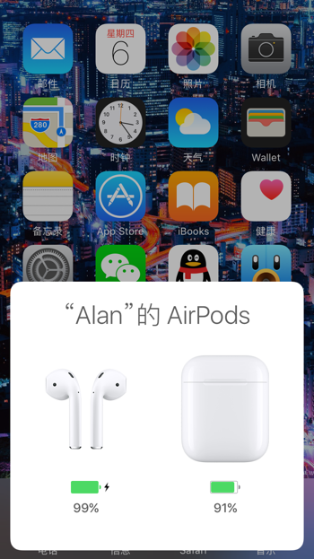
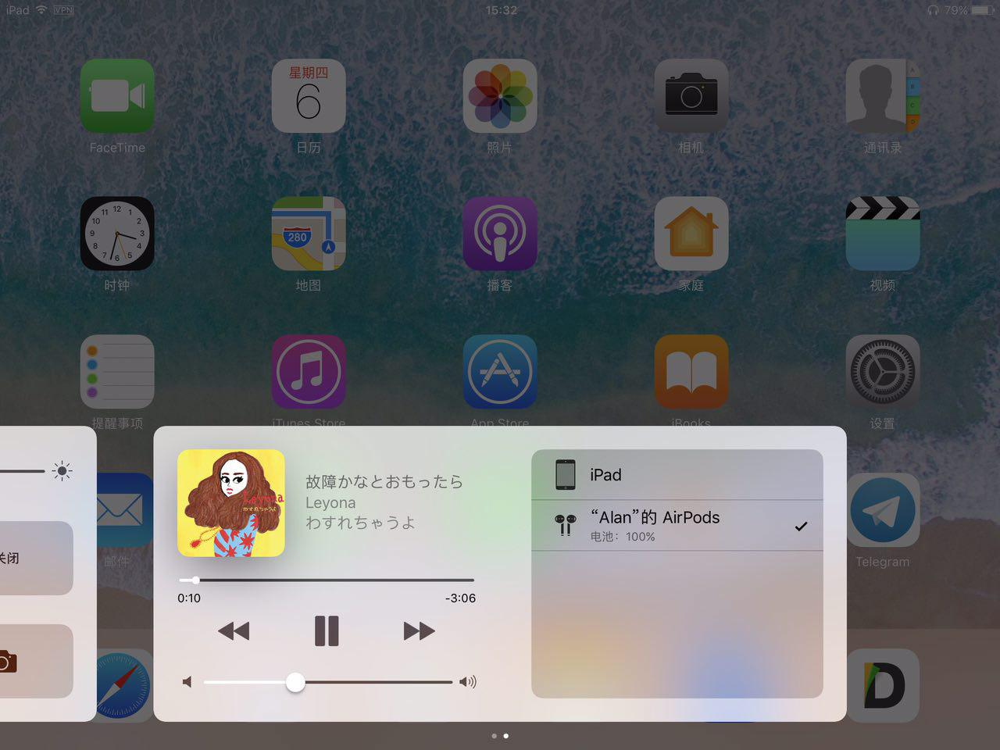
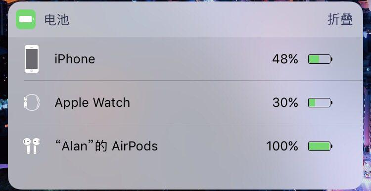

前几天没有忍住，下单了苹果的无线耳机：AirPods。这款耳机去年随 iPhone 7 发布，直到现在仍然处于缺货状态，任何时候去苹果官网看发货时间都是六周以后。拿到了之后非常兴奋，简单写写我的体验。

----------

一般来说若是提到「无线耳机」、「蓝牙耳机」，最容易想起来的是单只售卖的、黑色的、有着比较庞大的外观的话务式蓝牙耳机，也就是常见到司机开车时接电话用的那种。AirPods 的定位完全不是如此：它就是一款普通的耳机，在 iPhone 7 取消耳机孔之后用来接替 EarPods 的耳机，一款用来听音乐、通话的全功能耳机。

AirPods 虽然在平时没有见到几个人戴过，但是戴过的人普遍评价很高。苹果官方为它制定的宣传语是「无线，无繁琐，只有妙不可言」，这几天体验下来，我觉得这非常贴切。现在去网上翻一圈评论，说它易丢，说它外形不好看的大有人在，但是普遍对它的简单的配对方法、多设备切换的方便性赞不绝口。这些方面，我一个个来说一下我的体验。

----------

## 开箱、外观

拿到的 AirPods 是一个简单的苹果风格的盒子，里面除了充电盒与耳机本体外，不带别的配件，所以充电线与适配器需要与 iPhone 共用。

充电盒给我的第一感觉是非常漂亮、精致、小巧，拿到手上感觉温润圆滑，浑然一体。整个盒子除了底部充电口与背部转轴处是银色金属材质，其余部分是一个纯白的塑料盒。重量适中，不会给人轻飘飘的劣质感，我觉得带在身上也不会显得太重（不过厚度比 iPhone 要厚上许多）。盒盖与盒体我觉得是通过磁力来吸附的，只需要在正面凹陷处轻轻一拨盒盖即翻开，转动过程中几乎无阻尼感。打开后放置耳机的位置中间位置有一个小灯，用于判断目前耳机与充电盒的情况：包括电量与配对指示。 

耳机本体几乎就是 EarPods 剪掉线的样子，但是从耳机头延伸出来的部分比 EarPods 稍微粗一些。

外观总体上是一个仁者见仁的事。许多人觉得 AirPods 很难看，带上去非常尴尬根本不敢上街，我倒觉得还好。相比起来，AirPods 已经算是造型优雅很不扎眼了。戴一个巨大的头戴式耳机都能出街，AirPods 洒洒水啦。

----------

## 连接与配对

这个部分是 AirPods 最为人称道的部分。由于 AirPods 配备了所谓的 W1 芯片，再加上与 iOS 深度整合，AirPods 不需要一般配对蓝牙设备时的繁琐步骤（虽然对其他设备比如 Windows 设备仍然可以通过长按充电盒背部的按钮让它进入配对模式，像普通的蓝牙耳机一样使用）。我第一次使用时仅仅是把手机解锁，将 AirPods 放在距手机 10 厘米左右的地方然后打开盒盖，约过了一两秒钟手机上就自动弹出了配对提示，下图是配对后的样子。以后无需再次配对，只要在控制中心第二页选取播放设备为 AirPods 既可既可开始使用。过程还是非常流畅的。

与 iPad 的配对比较 tricky，之前听说配对信息是通过 iCloud 自动同步的，于是我就直接打开 iPad 的控制中心等着 AirPods 的选项出现……等到海枯石烂也没等出来。我觉得很奇怪，在 iPad 旁边打开充电盒也不会出现配对提示，抱着试一试的心态按之前说的，在盒盖打开的基础上按住充电盒背部的按钮，直到盒内指示灯为白色闪烁，然后在 iPad 上打开蓝牙选项当作普通的蓝牙设备配对。配对成功后 iPad 自动识别出了这是一个 AirPods，随后就能够正常使用了。

一旦与 iPhone 配对成功，Apple Watch 也就自动的配对成功了。

macOS 上由于需要 macOS 10.12 及以上所以未测试，我估计也需要先配对一次？

----------

## 使用与多设备切换

这是普通的蓝牙耳机最恼人的部分，据说 AirPods 将这个问题解决到了几乎完美的地步，所谓的能实现「无缝切换」。据我的体验，方便是确实是方便了不少，但还做不到所谓的「无缝」，还是有那么一点缝的。

### 使用

使用很简单，只要将耳机从充电盒里取出塞进耳朵里，AirPods 会根据传感器信息自动判断出已经处于佩戴模式，这时耳机里会有提示音。这时候在手机或者别的设备上选择输出为 AirPods 然后开始使用即可。

在使用过程中，如果取下一只耳机，会停止播放，戴回去之后会自动开始（或者手动开始也可以继续播放）；如果同时取下两只耳机，同样会停止播放而且戴回去之后也不会自动开始。这个 feature 我尝试了十来次，基本能成功，只有一两次摘下一只耳机后，另一只耳机延迟了五六秒才停止播放。虽然等得久一点，但总还是停了，这个功能总体还是值得信赖的。

在佩戴状态下，轻敲任意一只耳机可以唤出 Siri，这时可以通过语音执行操作。虽然苹果觉得 Siri 是可以作为一个个人助理无处不在的存在，但我还是不能在众人面前说出「调高音量」、「下一首」，太尴尬了。iOS 11 里增加了轻敲耳机进行「上一曲」和「下一曲」等操作，音量控制我觉得，要不就用手机控制，要不就用手表吧……我可不想在地铁上 Siri 打死听不懂我的话然后对它发飙：「你特么听不懂调高音量吗！？」。

### 多设备切换

多设备切换时，只需在需要使用的设备上选择 AirPods 作为播放源即可，原来使用的设备会自动停止播放，把控制权交给新的设备。这是比较理想的情况。实际上比如 AirPods 在 iPhone 上使用时打开 iPad 的控制中心，会看见播放设备并没有 AirPods，需要稍等一会儿才能看见它出现。这就说明 AirPods 不是随时与所有附近的设备保持联系，当你尝试切换播放源的时候，是有一个事件同步机制的，设备会通过 iCloud 传送信息，然后是一个寻找并切换的过程。

由于有 iCloud 的介入，整个过程就变得比较靠人品了。我在使用的过程中，出现了多次打开了控制中心等了好久才出现 AirPods 选项的情况；即使出现了 AirPods 选项，点击之后也要等那个菊花转啊转转半天。这就是我说为什么还没有做到「无缝切换」，还是有点缝的。这个问题在使用过程中有时会变得很恼人，也许是我的网络问题，如果是软件的问题，我希望苹果能够优化一下。

----------

## 其它

### 舒适度与隔音

AirPods 不是一个隔音耳机。虽然耳机头和一般的平头塞不太相同，但是当然也不属于入耳塞，所以基本没有「听诊器效应」。因为不隔音，AirPods 不适合戴到公共场合，因为需要将音量调到相当高才能听清内容，而高音量对听力相当有害。

舒适度上，我一向喜欢平头塞。戴眼镜的人想要找到一款舒适的头戴式耳机很难，头戴式耳机也容易给人闷闷的感觉；可能由于我的耳朵构造异于常人，入耳式耳机无论如何都要往外掉，试了各种耳机套都是这样（很郁闷，这代表我与大量的高端耳机无缘），另外入耳式耳机的听诊器效应让我也非常难受。自我遇见 EarPods 时我就觉得天哪怎么早没发现还有这么棒的佩戴感！可以预见我对 AirPods 的佩戴感也非常满意。

至于是否容易掉落，我的答案是在我耳朵里完全不会。正常佩戴时，我把脑袋像嗑药了似的摇 AirPods 甚至没有松动的迹象，运动时还没有试。所以只要能正常佩戴 EarPods 我觉得就没必要太担心这个问题。

### 续航与充电

AirPods 通过与之配套的充电盒充电，充电盒本身可以和 iPhone 共用充电器。只要将耳机放进充电盒，即可通过耳机底部的金属部分和充电盒内部金属触点接触充电。

据苹果官方网站描述：

> 由于低功耗的 W1 芯片对电池续航时间的管理十分出色，因此 AirPods 一次充电即可最长聆听 5 小时，表现出众。它们经过精心打造，旨在供你随时使用；由于充电盒额外提供多次充电，使这款耳机可满足超过 24 小时的电量使用。需要快速充电？只需放入充电盒中 15 分钟即可获得最长可达 3 小时的使用时间。

我一般是相信苹果从不在续航上撒谎。在实际使用过程中，我还没有遇到电量不足的问题。养成不用时将 AirPods 收进充电盒的习惯，充电盒本身保持一两天一充，中度使用应该是够用了。

查看电量有几种方式：

- 通过 iPhone 上的电量小部件查看 AirPods 的电量。
- 在当 AirPods 在盒子里的时候在 iPhone 边打开盖子，iPhone 上会弹出电量信息。
- 电量盒里的小灯也可以指示充电盒的电量状态。
- 控制中心也可以查看耳机与充电盒的电量。

### 信号强度与连接质量

我简单在自己家里测试了一下，家中蓝牙环境比较好，蓝牙设备不多，所以可能发生的信号干扰比普通办公室环境少一些。

虽然普通的蓝牙设备是保证在 10 米开阔范围内能够正常使用，我测试的结果（与 iPhone 连接）是直到 15 米的开阔场合也能正常工作。弱中间有障碍物（墙），大约在 10 米以下可以工作，再远就有明显的连接质量下降，传送音频断断续续，Siri 几乎不可用。

普通的使用场景下，AirPods 的连接质量与普通的蓝牙耳机相似，所以不要指望它有秒杀其它产品的能力。

### 音质

这就不是我的能力范畴了。我个人感觉，与 EarPods 别无二致。当然我也没有对它的音质抱有很高期待。

----------

## 总结

说了半天，流水账式的把我的体验描述了一遍。我觉得 AirPods 应该是苹果相当得意的产品，[据称客户满意度高达 98%](https://www.macrumors.com/2017/05/01/airpods-98-percent-satisfaction-rate/)。从我在社交网络上的观察来看，大家也都很喜欢这款产品。

我得承认，以后的电子产品将会是无线的天下，云的天下；而苹果在这个方向已经缓步推进了好些时日了。通过云平台（iCloud）的能力，苹果让自家设备配合默契，对外表现就是用起来极为顺手，直观。AirPods 这款产品，满足了我对一副日常使用的无线耳机的几乎所有期待，即使有一些小问题，仍然瑕不掩瑜。不论是初代 iPhone 和别的苹果初代产品，一般苹果都会有些保守，然后才慢慢完善，而 AirPods 从一开始就以完成度很高的姿态亮相，也不枉大家的盛赞。

当然啦，作为一个使用 iPhone 7 还想边充电边听音乐的人，能怎么办呢？只能买买买呀！